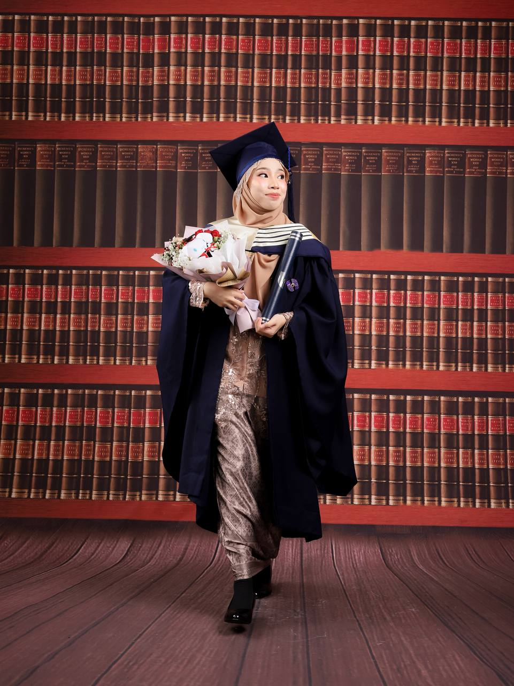

  
  <h1>Hi, I'm NurFatin Aina Rizal 👋</h1>
  <h2 id="typing"></h2>
  <a href="https://www.linkedin.com/in/nurfatinainarizal" class="btn">Hire Me</a>

<section>
  <h2>🚀 About Me</h2>
  

    Software Engineering graduate passionate about building scalable and modern web applications.
    I enjoy turning ideas into real-world systems using React, Firebase, and backend technologies.
  

</section>

<section>
  <h2>💻 Projects</h2>

  

    

      <h3>Quizment System</h3>
      
AI-powered quiz platform with analytics, leaderboard, and auto grading.

    

    

      <h3>MMU Hub</h3>
      
Student management system using PHP & MySQL.

    

    

      <h3>Chess Game</h3>
      
Java OOP-based chess game with full logic system.

    

  

</section>

<section>
  <h2>🛠 Skills</h2>

  

    
JavaScript

    

  

  

    
React

    

  

  

    
Firebase

    

  

</section>

<section>
  <h2>📫 Contact</h2>
  
Email: fatinainarizal@gmail.com

</section>
